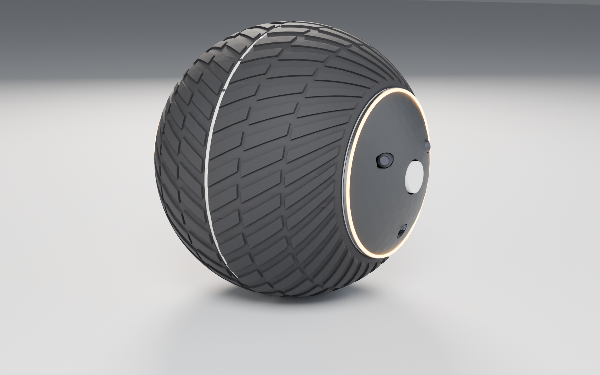
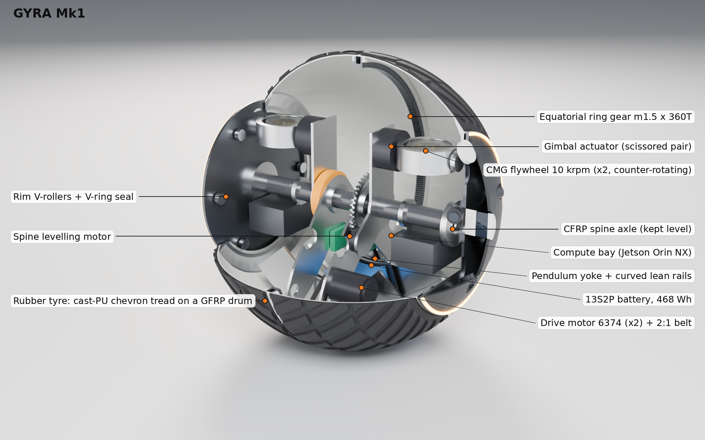
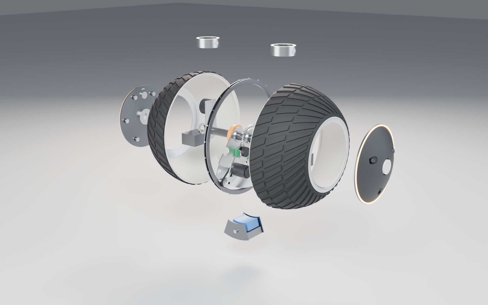
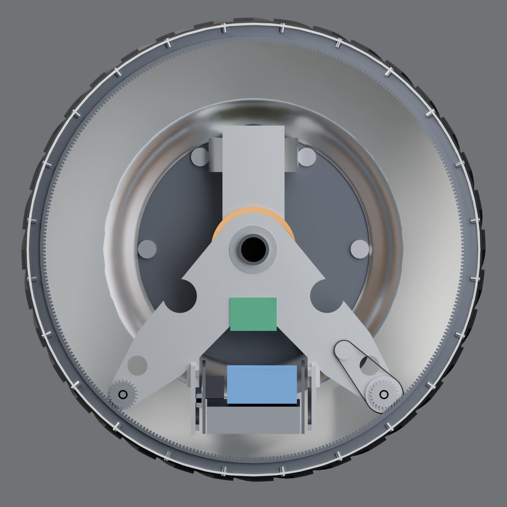
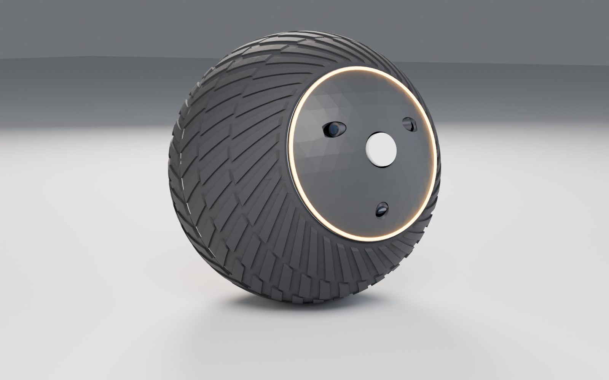
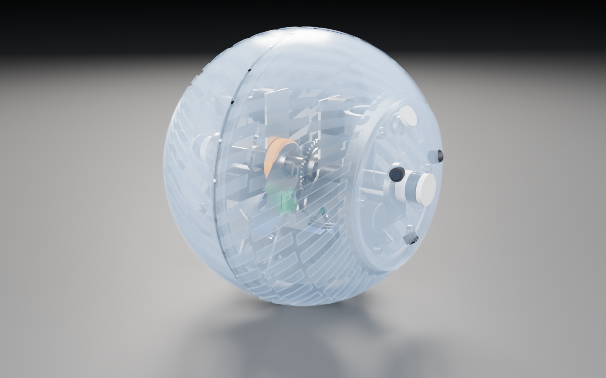
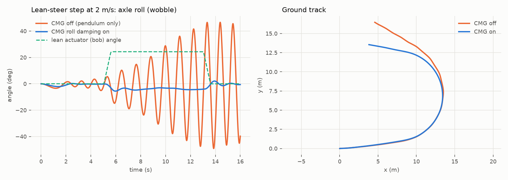
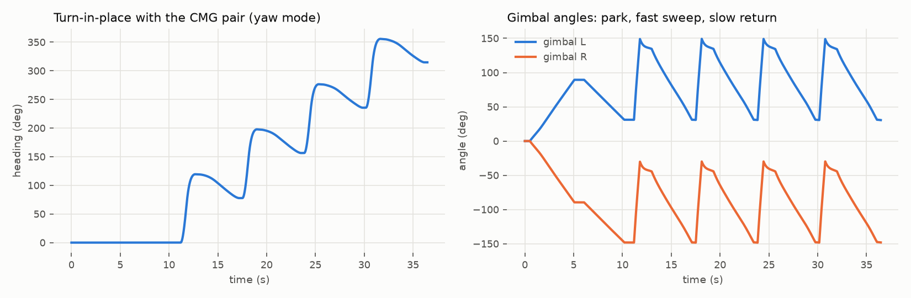

# GYRA Mk1: a rubber-tyred spherical robot with a level sensor spine and a scissored CMG pair



This repo has two parts:

1. **A teardown of how the RT-G (Rotunbot/RotunBot) police robot actually works**, from
   the Zhejiang University paper behind it plus press and company sources:
   **[docs/01_RT-G_how_it_works.md](docs/01_RT-G_how_it_works.md)**
2. **GYRA Mk1**, a new design that keeps the RT-G's best idea (a wide rubber tyre
   rolling around a non-rotating sensor axle) and adds:
   * a **level sensor spine**, mechanically separate from the drive pendulum: the pods
     stay within 0.75° while the pendulum swings 46°;
   * a **scissored, counter-rotating CMG pair** that gives **pure roll torque**
     (stops lean-steer wobble) *or* **pure yaw torque** (turns on the spot at zero
     speed), with zero net momentum when idle;
   * an **equatorial internal ring-gear drive** (30:1) with **two anti-backlash
     pinions**;
   * a **self-locking worm lean drive** that holds a lean at zero power.

   Full spec: **[docs/02_GYRA_Mk1_design.md](docs/02_GYRA_Mk1_design.md)** ·
   simulation: **[docs/03_simulation.md](docs/03_simulation.md)** ·
   interactive 3-D viewer: **[docs/viewer/index.html](docs/viewer/index.html)**
   (open locally in a browser)



## The short version of "how RT-G works"

* The **central rubber shell** (fibre-reinforced rubber with a tread, 27.6 kg) is the
  only part that rolls. **The side pods are bolted to the main shaft**, so cameras,
  LiDAR and GNSS see out directly; there's no transparent hull.
* A motor on the internal frame turns the shell. Its reaction torque **lifts a 73 kg
  pendulum** (battery inside), and gravity does the driving. Grade and acceleration are
  limited by m·g·L of the pendulum, not by the motor.
* **Steering = leaning.** A second motor swings the pendulum sideways. The spinning
  shell precesses toward the low side, like a rolling coin, so the turn radius grows
  with v².
* A **42 cm momentum wheel** with its axis along the direction of travel only damps
  roll wobble. That's what let the RT-G reach 10 m/s.
* Correction to the "axis stays stable" idea: the pods are held level only by gravity,
  and **they pitch with the pendulum** when the robot accelerates, brakes or climbs.
  GYRA fixes this.

## GYRA Mk1 at a glance (all derived from the CAD model)

| | | | |
|---|---|---|---|
| Diameter | **600 mm** | Mass | **41.4 kg** (CoM 59 mm below centre) |
| Top speed | **6.4 m/s** (23 km/h) | Drive | 2 × 6374 BLDC → belt → ring gear, **30:1** |
| Grade | **10°** demonstrated in sim (13.6° static) | Lean torque | **11.2 N·m** sustained, + **18.5 N·m** CMG burst |
| Turn radius | 1.3 m @ 1 m/s · 5.8 m @ 2 m/s (sim) | Turn in place | **yes** (CMG yaw mode) |
| Sensors | 2 × Livox Mid-360, 6 × GS cameras (0.56 m stereo baseline), dual-antenna RTK | Compute | Jetson Orin NX 16 GB |
| Battery | 468 Wh, ~4 h / 45 km @ 3 m/s | Water | floats at 41 % draft, chevron tread paddles |
| Parts | 89 | Interferences | **0 across 45 mechanism poses** (B-rep check) |

| Exploded | Section through the drive plane |
|---|---|
|  |  |
| **Leaning into a turn** | **X-ray** |
|  |  |

### Simulation highlights (MuJoCo, model generated from the CAD inertias)
| Lean-steer at 2 m/s: CMG off vs on | Turn in place at zero speed |
|---|---|
|  |  |

## Repository layout
```
cad/params.py            single source of truth for dimensions
cad/gyra_cad.py          parametric CadQuery model → STEP / STL / mass properties / interference check
cad/export_glb.py        → cad/out/gyra_mk1.glb
cad/out/                 gyra_mk1.step (coloured assembly), stl/, glb, mass_properties.json, interference_report.json
calc/sizing.py           closed-form sizing from the CAD mass properties → calc/out/sizing.json
sim/gyra_model.py        MJCF generator (CAD inertias → MuJoCo)
sim/scenarios.py         closed-loop experiments → sim/out/summary.json, media/sim_*.png
render/render_gyra.py    Blender Cycles renders (hero, cutaway, x-ray, exploded, sections, poses)
render/annotate.py       visibility-checked call-out labels
render/build_viewer.py   self-contained three.js viewer → docs/viewer/index.html
docs/                    research report, design spec, simulation report
```

## Reproduce
```bash
pip install cadquery mujoco numpy scipy matplotlib trimesh pillow
python cad/gyra_cad.py --check        # CAD, exports, mass properties, 45-pose interference check
python cad/export_glb.py
python calc/sizing.py
python sim/scenarios.py
BLENDER=/path/to/blender render/render_all.sh
python render/annotate.py media/gyra_cutaway.png media/gyra_cutaway_annotated.png
python render/build_viewer.py
```
Tested with CadQuery 2.8 / OCCT 7.9, MuJoCo 3.15, Blender 4.2 LTS.

## Status
Mk1 is a **concept-level CAD and simulation design**, not yet built. Gears use
trapezoidal tooth approximations. Purchased parts are modelled as envelopes with their
real masses. The main open items are in §7 of the design doc: grade capability, seal
validation and flywheel spin-down/burst testing.
