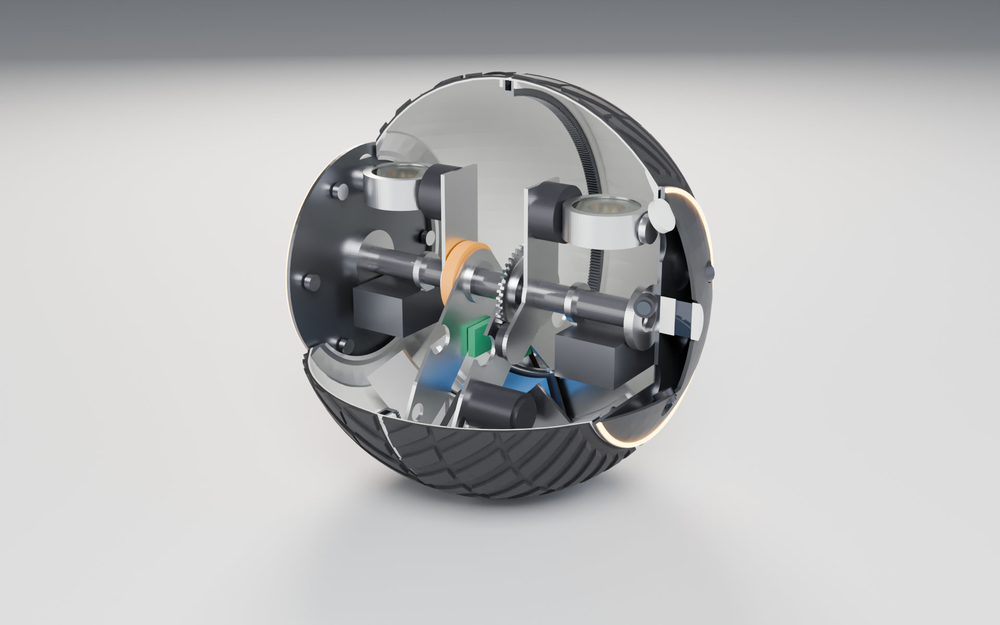
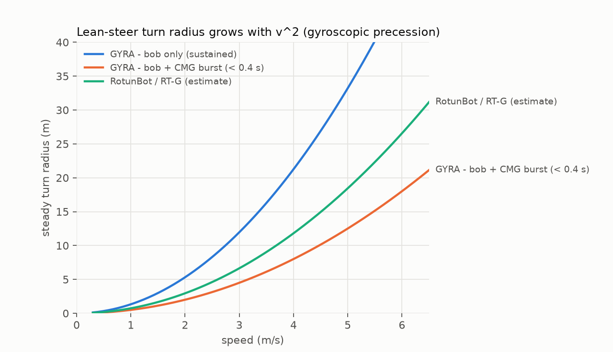

# GYRA Mk1: design specification

**GYRA** (*gyro + gyrate*) is a 600 mm, 41 kg, amphibious, rubber-tyred spherical robot.
It keeps what makes the RT-G work (a single wide rubber tyre that rolls around a
non-rotating sensor axle, driven by a pendulum) and adds four ideas the RT-G doesn't have:

1. a **level sensor spine** that is mechanically separate from the pendulum,
2. a **scissored, counter-rotating CMG pair** that does **roll** *and* **yaw**,
3. an **equatorial ring-gear drive** with dual anti-backlash pinions,
4. a **self-locking worm lean drive** (lean held at zero power) paired with the fast CMGs.


---

## 1. Architecture: four coaxial bodies on one axle

```
        z ↑   x → (forward)    y ⊙ (left, along the axle)

  ┌──────────────── TYRE (rotates about y) ────────────────┐
  │ GFRP drum halves + cast-PU chevron tread               │
  │ equatorial internal ring gear m1.5 × 360T (joins halves)│
  │ aluminium rim rings with V-tracks at both edges        │
  └───────▲──────────────────────────────▲─────────────────┘
          │ 2 × 24T pinions (drive)       │ 6 V-rollers per side
  ┌───────┴───────── YOKE (pendulum) ─────┐  ┌────┴──────── SPINE (sensor axle) ────────┐
  │ hanger plates on 6908 bearings         │  │ CFRP axle Ø40 + 2 sensor pods          │
  │ 2 × 6374 BLDC → HTD belt 2:1 → pinions │◄─┤ levelling motor (spine ↔ yoke)         │
  │ cradle arc plates + curved rails/rack  │  │ CMG pair (gimbals ∥ y) + gimbal motors │
  └───────▲────────────────────────────────┘  │ compute bay, power/IMU bay, clockspring│
          │ curved rails, worm + pinion        └────────────────────────────────────────┘
  ┌───────┴──────── BOB ───────────────────┐
  │ 13S2P battery + 8.4 kg lead ballast     │   rides a ±30° arc about the x axis
  └────────────────────────────────────────┘
```

| Body | Joint (to its parent) | Mass (CAD) | CoM (mm) |
|---|---|---|---|
| Tyre | revolute **y**, on the spine's rim rollers | 11.31 kg | centre |
| Spine | — (free body) | 9.47 kg | (3, 9, 9) |
| CMG gimbals ×2 | revolute **y** at (0, ±170, 122) | 0.48 kg each | |
| Flywheels ×2 | revolute **z** (gimbal frame) | 1.50 kg each | |
| Yoke | revolute **y** on the axle (6908 bearings) | 5.74 kg | (2, 0, −129) |
| Bob | revolute **x** on the yoke's curved rails | 10.92 kg | (0, 0, −208) |
| **Robot** | | **41.39 kg** | **59 mm below centre** (self-righting) |

All masses, centres and inertia tensors come from the CadQuery model
(`cad/out/mass_properties.json`). The MuJoCo model is generated directly from them.



---

## 2. The four new ideas

### 2.1 Level sensor spine (three coaxial bodies instead of two)
In the RT-G the pods are bolted to the shaft frame. The frame carries the drive motor,
so it pitches with the pendulum. In GYRA the **drive motors react against the yoke
only**. The **spine** (axle + pods + CMGs + compute) is a separate body that touches the
yoke through one small **levelling motor**. That motor holds the spine level (IMU on
the spine, PD loop), and its reaction torque goes into the heavy pendulum, which barely
notices it.

* Simulated 0 → 3 m/s → 0: the **pendulum swings to 46°**, the **sensor spine stays
  within 0.75°** (see `03_simulation.md`).
* Bonus: the levelling motor can **nod** the spine on purpose (±20°) to sweep the LiDARs
  for denser 3-D scans, or to look up stairs or down slopes.
* The spine is balanced: its CoM sits 9 mm from the axle, so the levelling torque is
  tiny (< 2 N·m in the drive test).
* Power and data cross the spine/yoke joint through a **clockspring** (flat wound
  ribbon, like a car's steering-wheel airbag reel). A hard stop at ±75° pendulum pitch
  means the reel never needs more than one turn. That's cheaper, quieter and more
  reliable than a slip ring.

### 2.2 Scissored CMG pair: one mechanism, two jobs
Two 100 mm steel ring flywheels spin in **opposite** directions at 10 000 rpm
(h = 2.31 N·m·s each, 1.2 kJ stored each) inside sealed housings. Both gimbals turn
about **axes parallel to the axle**.

**Roll mode** (spin axes near vertical). The gimbals move in opposite directions
(scissor, γ_L = +γ, γ_R = −γ):

  H = h(sin γ, 0, cos γ) + h(sin γ, 0, −cos γ) = 2h sin γ · x̂ → torque on body = −2h cos γ γ̇ · x̂

That is a **pure roll torque** of up to **18.5 N·m** at 4 rad/s gimbal rate. That's more
than the bob's whole sustained lean authority (11.2 N·m), with zero cross-coupling into
pitch or yaw. **Net stored momentum is zero at γ = 0**, so the robot does *not* behave
like a gyroscope when the CMGs are idle. A single big momentum wheel (the RT-G approach)
would add unwanted precession on every turn.

**Yaw mode** (gimbals parked at γ_L = +90°, γ_R = −90°, spin axes horizontal fore-aft,
still zero net momentum). The gimbals now sweep **together** by δ:

  H = (0, 0, −2h sin δ) → torque on body = +2h cos δ δ̇ · ẑ

That is a **pure yaw torque** of up to **18 N·m**. It beats the tyre's pivot friction
(≈ 8.5 N·m for a 35 mm contact patch), so **GYRA can spin on the spot at zero speed**.
Pendulum spheres, including the RT-G, can't do this. Each fast sweep (120°) turns the
robot about 75-110°. A slow return (torque below stiction) resets the gimbals.
Simulated: **315° in 4 cycles with 6 cm drift**.

Roll mode buys you:
* **wobble suppression**: in the sim, lean-steering at 2 m/s diverges to ±45° roll
  with the pendulum alone, versus **±0.7° with CMG damping**;
* **instant turn-in**: it cancels the "wrong-way" reaction torque you get when the bob
  starts swinging;
* **fall/kerb recovery**: a 4 N·m·s roll impulse is enough to stop a side-tip from a
  kerb strike.

Sizing and safety: flywheel ring OD 100 / ID 50 / 30 mm, 4340 steel, rim speed 52 m/s
(very low for steel, so the margin to burst is above 10×). The housings are
aluminium cans with polycarbonate inspection lids. The gimbal actuators are CubeMars
AK70-10 class (the gyroscopic load at 2 rad/s body rate is 4.6 N·m, against 8 N·m
continuous). Spin motors are about 40 W; spin-up takes about 60 s; idle drag is about
12 W per wheel.

### 2.3 Equatorial ring-gear drive
The drum is made as two GFRP halves bolted through an **internal ring gear at the
equator** (m 1.5, 360 T, Ø540 pitch, PA66-GF30 segments, I-section web). The bolts sit
in the tread's centre groove. Two **24 T steel pinions** on the yoke engage it at ±42°
from bottom dead centre. Each is driven by a **6374-class 150 KV BLDC** through a
**2:1 HTD belt**:

* overall ratio **30:1** with the final stage at the largest possible radius, so tooth
  loads are low (28.6 N·m ÷ 0.27 m ≈ 106 N at the mesh);
* two pinions **pre-loaded against each other** remove backlash (the motors apply
  opposing bias torque at standstill), so there's no clunk when the pendulum
  reverses;
* redundancy: one motor alone can still drive at full pendulum-limited torque, since
  0.53 N·m per motor is needed against 3.8 N·m peak available;
* top speed ≈ **6.4 m/s (23 km/h)** at 48 V; drive torque is pendulum-limited at
  **28.6 N·m**.

### 2.4 Worm lean drive + CMG = slow-strong / fast-light
The **bob** (13S2P battery and 8.4 kg of lead) rides **curved rails** on the yoke's
cradle along a **±30° arc about the x axis**, driven by a **self-locking worm** and a
pinion on a curved rack. It provides a **sustained lean torque of 11.2 N·m with zero
holding power**. The worm can't back-drive, so a turn costs energy only when the lean
*changes*. It is slow by design (45°/s); the CMG pair supplies the bandwidth.

---

## 3. Key numbers (from `calc/sizing.py`, all derived from CAD mass properties)

| | |
|---|---|
| Diameter / tyre width | 600 mm / 470 mm (tyre covers ±51.6° latitude) |
| Mass | 41.4 kg (tyre 11.3, pendulum 16.7, spine + CMGs 13.4) |
| CoM below centre | 59 mm (self-righting from any orientation) |
| Pendulum m·L | 3.02 kg·m (L_eff = 181 mm) |
| Max pendulum drive torque | 28.6 N·m (pitch stop 75°) |
| Drive ratio / top speed | 30:1 / **6.4 m/s (23 km/h)** |
| Max acceleration | 1.9 m/s² |
| Grade | **10° demonstrated in sim** (13.6° static limit) |
| Step | 8 mm static; ~130 mm dynamic (scaled from RotunBot's 17 cm @ R 0.4 m) |
| Sustained lean torque (bob ±30°) | 11.2 N·m |
| CMG pair roll / yaw torque | 18.5 N·m / 18 N·m (4 rad/s gimbal) |
| Turn radius (bob only) | 1.3 m @ 1 m/s · 5.3 m @ 2 m/s · 12 m @ 3 m/s · 48 m @ 6 m/s |
| Turn in place | yes, ~75-110° per CMG sweep |
| Flotation | floats with 41 % of the diameter submerged (246 mm draft), 72 kg reserve buoyancy |
| Battery / endurance | 468 Wh (13S2P 21700) / ~4.2 h, ~45 km at 3 m/s |



---

## 4. Subsystem details

### Tyre
* **Drum**: two 2.5 mm GFRP spherical zones (|y| ≤ 235 mm). Each is laid up on a male
  plug and flanged at the equator for the ring gear.
* **Tread**: cast polyurethane, Shore 70A, 3 mm base + 4 mm chevron lugs (36 pitches ×
  3 rows per side, mirrored, half-pitch staggered). The chevron self-cleans mud and
  works as **paddles in water**. The 10 mm centre groove hides 24 × M5 equator bolts.
* **Rims**: 6061 rings bonded into each tyre edge, with a 90° V-track at r = 150 mm.
  Six eccentric-mounted V-rollers per pod carry the tyre (like a HepcoMotion PRT ring
  slide), so the pods can be **full rim size (Ø352)** without a huge thin-section
  bearing. A Forsheda **V-ring seal** at the 4 mm tyre/pod gap gives IP67.

### Spine
* **Axle**: CFRP tube Ø40/32, clamped into both pod plates. It carries the pendulum
  loads (≤ 1 kN dynamic).
* **Pods** (×2): 6 mm aluminium plate with lightening pockets, a 6 mm PA12 MJF shield
  (spherical cap, same R 300 as the tyre so the robot stays a sphere), and these
  sensors:
  * **Livox Mid-360** LiDAR on the axle line (360° × 59° FOV around the axle: sees
    forward, up, back and the ground on its side),
  * **3 global-shutter cameras** per pod: front (18° toe-out), rear, and ground/near-field.
    The two front cameras form a **stereo pair with a 0.56 m baseline**,
  * **u-blox ZED-F9P** antenna under a radome on each pod. With two antennas
    0.49 m apart you get **dual-antenna RTK heading**,
  * an amber **status light ring** at the pod rim.
* **Forward blind wedge**: the tyre (470 mm wide) blocks inward-looking rays. Pod
  sensors at y ≈ ±285 mm see the centreline from about 1.1-2.3 m ahead. Closer
  obstacles are tracked from the map built as they approach, and in-place yaw sweeps
  give a full look-around. (A radar *through* the non-metallic tyre is a Mk2 research
  item.)
* **Bays** below the axle (outside the pendulum's swept volume): left holds a Jetson
  Orin NX 16 GB plus carrier; right holds power distribution, a 9-axis IMU and radios.
* **Levelling motor**: pancake BLDC with a planetary reduction, pinion on a POM gear on
  the yoke hub.
* **Clockspring** on the −y side between the spine bracket and the yoke hub.

### Yoke & bob
* Hanger plates (6061, 6 mm) on 6908-2RS bearings carry both motor bosses and both
  pinion shafts. The shafts are supported at both ends.
* The cradle's arc plates (y-z sectors, ±50°) carry two curved V-rails each and one
  curved rack.
* Bob: lead casting (r 203-238 mm) plus a 13S2P 21700 pack (468 Wh) plus the worm
  gearmotor, all on a carriage with four V-rollers per side.
* The ESCs (2 × ODrive S1 class) sit on the inner faces of the hanger plates.

### Swept-volume design rule
Every pendulum part lives inside |y| ≤ 157 mm. Every spine part is either **outside**
that slab or **inside** r < 106 mm of the axle. The CMGs sit above the axle, and the
pendulum's ±75° stop keeps it out of the top sector. **`cad/gyra_cad.py --check`
verifies this with real B-rep booleans across 45 poses** (pitch −75…75°, lean ±30°,
gimbals 0 / ±90 / ∓60°): **0 interferences**.

---

## 5. Bill of materials (prototype, single unit, estimated USD)

| Item | Qty | Part / class | ≈ USD |
|---|---|---|---|
| Drive motors | 2 | 6374 150 KV outrunner | 140 |
| Drive controllers | 2 | ODrive S1 | 300 |
| Gimbal actuators | 2 | CubeMars AK70-10 | 900 |
| Levelling actuator | 1 | AK60-6 or GBM5208 + planetary | 250 |
| Flywheels + spin motors | 2 | 4340 ring (machined) + 40 W BLDC + ESC | 450 |
| LiDAR | 2 | Livox Mid-360 | 1500 |
| Cameras | 6 | IMX296 global shutter, M12 lenses | 360 |
| GNSS | 2 | u-blox ZED-F9P + patch antennas | 500 |
| Compute | 1 | Jetson Orin NX 16 GB + carrier | 900 |
| IMU | 1 | industrial 9-axis (e.g. Bosch BMI088 + mag) | 60 |
| Battery | 1 | 13S2P 21700 + smart BMS | 320 |
| Ballast | 1 | lead casting 8.4 kg | 60 |
| Tyre | 1 | GFRP drum (plug, mould, layup) + PU tread cast | 1400 |
| Ring gear | 1 | PA66-GF30, 6 segments (printed or water-jet) | 200 |
| Structure | — | water-jet 6061 plates, CFRP axle, MJF PA12 shields | 700 |
| Bearings, rollers, rails, seals, worm, belts | — | | 400 |
| Clockspring, wiring, connectors, fasteners | — | | 250 |
| **Total** | | | **≈ 8.6 k** |

## 6. Assembly sequence
1. Spine core: slide the bays, brackets, levelling motor and clockspring onto the axle.
2. Slide the yoke hub bearings on, mount the drive trains and arc plates, and fit the
   bob on its rails.
3. Mount the CMG modules on the spine brackets (inner gimbal actuators).
4. Bolt the drum halves to the ring gear around the internals (pinions mesh through
   the open rims), then torque the equator bolts from outside through the tread groove.
5. Fit the pods. The rollers engage the rim tracks, set preload with the eccentric
   pins, then bolt the pod plates to the axle flanges and fit the V-ring seals.
6. Fit the pod shields and sensors.

## 7. Risks and what Mk2 should change
* **Grade (10°)** is the weak spot of every pendulum sphere. Mk2: move the compute and
  CMGs into the pendulum, or use denser ballast (tungsten), to raise m·L/(M·R) from
  0.24 to above 0.30 (≥ 17°).
* **High-speed turn radius** grows with v². The CMG gives short bursts only. A
  speed-scheduled lean controller plus braking into corners is required.
* **Pivot stiction** sets how much of each CMG sweep is kept. Characterise it on real
  surfaces.
* **Flywheel containment** is low risk (52 m/s rim) but still needs a burst and
  spin-down test.
* **Sealing** of a 352 mm rotary joint: V-ring plus a labyrinth. Validate with a
  dunk test.

Full CAD: `cad/out/gyra_mk1.step` (89 parts, coloured) · `cad/out/gyra_mk1.glb` · `cad/out/stl/`.
