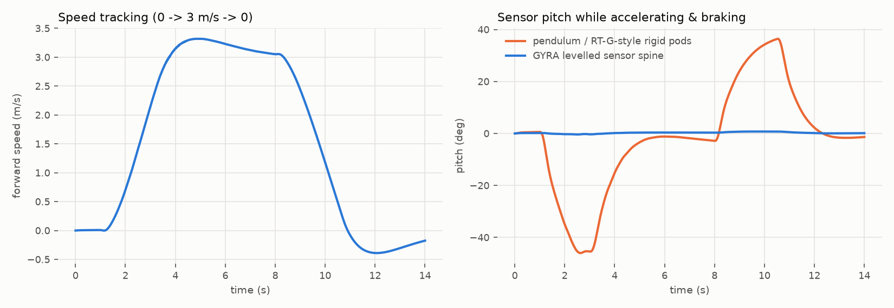
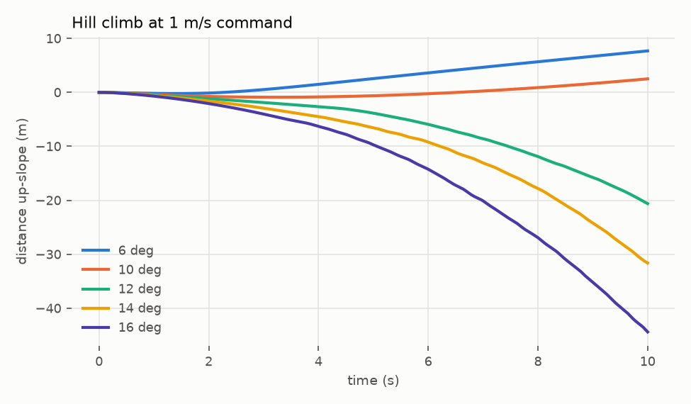

# GYRA Mk1: physics simulation (MuJoCo 3)

`sim/gyra_model.py` generates the MJCF straight from `cad/out/mass_properties.json`.
Every body uses its CAD mass, centre of mass and full inertia tensor, so the simulation
and the CAD can't drift apart. `sim/scenarios.py` runs the closed-loop experiments
below; the numbers come from `sim/out/summary.json`.

```
python cad/gyra_cad.py      # CAD → mass properties
python sim/scenarios.py     # ≈ 10 s on a laptop, writes media/sim_*.png
```

## Model
* Kinematic tree: spine (free) → {tyre ⟂y, yoke ⟂y → bob ⟂x, cmgL ⟂y → flyL ⟂z, cmgR ⟂y → flyR ⟂z}. 13 DoF.
* Contact: tyre = sphere R 0.30 m, `condim 6` (sliding μ = 1.0, torsional 0.021 m = ⅔·μ·a for a 35 mm patch, rolling 0.006 m ≈ C_rr 0.02).
* Drive torque acts between yoke and tyre through a fixed tendon (`tyre − yoke`), so the reaction lands on the pendulum, as on the real robot. The levelling motor acts between yoke and spine.
* Flywheels spin at ±10 000 rpm under velocity servos. Gimbals are velocity servos limited to ±12 N·m. The lean drive is a stiff position servo, rate-limited to 45°/s (worm).
* 0.5 ms implicit-fast integrator, 500 Hz control.

## Controllers (all deliberately simple)
| loop | law |
|---|---|
| speed | cascade: PI(v) → pendulum swing set-point, **clamped ±65°** (never drives the pendulum over the top) → PD → drive torque |
| spine levelling | PD on spine pitch → levelling motor |
| heading hold | lean (bob) ∝ heading error − yaw rate (precession steering) |
| CMG roll mode | scissor gimbal rate γ̇ = k·ω_roll / (2h cos γ) − c·γ (roll-rate damping + centring) |
| CMG yaw mode | gimbals parked at ±90°, fast common sweep −60° → +60°, slow return |

## Results

### 1. Drive: the levelled spine works


The robot runs 0 → 3 m/s → 0 (cruise 3.2 m/s). During the launch **the pendulum
(which is what an RT-G pod is bolted to) pitches 46°**. **The GYRA sensor spine peaks
at 0.75°.**

### 2. Lean-steer at 2 m/s: the CMG kills the wobble


At t = 5 s the bob steps to 25° and holds:

| | roll std | roll peak-to-peak | turn radius |
|---|---|---|---|
| pendulum only (CMG off) | 24.5° | **89°**, growing | ill-defined (5.0 m mean) |
| **CMG roll damping on** | **0.48°** | **1.4°** | **5.8 m** |

Pendulum-only, the lean step excites the classic pendulum-sphere wobble mode, and at
2 m/s it grows. The RotunBot paper reports the same divergence above 2 m/s without its
momentum wheel. With the CMG pair damping roll rate, the robot settles into a clean
circle. The **simulated 5.8 m radius matches the closed-form precession estimate of
5.3 m** (`calc/sizing.py`) to within 10 %.

Note: the "off" case uses an open-loop lean step. The RT-G closes a PI loop on roll
angle with its pendulum, which helps at low speed but is limited by the pendulum's
slow, heavy dynamics. The CMG adds roll authority at a bandwidth the pendulum can't
reach.

### 3. Turn-in-place at zero speed


The gimbals are first parked at ±90° (slowly, so the roll disturbance stays small).
Then each fast common sweep (−60° → +60° at 4 rad/s, about 15 N·m of yaw torque, well
above the 8.5 N·m pivot friction) spins the robot about 110°. The slow return gives
back about 35°, because the simulated rubber has finite stiction, even with MuJoCo's
no-slip solver. **Net 315° in four 6-second cycles, with 7 cm of drift.** The
closed-form estimate is ~73° net per sweep; the simulation gives ~79°.

### 4. Grades


With the pendulum clamped at ±65°, the theoretical static limit is
asin(m·L·sin65°/(M·R)) ≈ 12.3°. In the simulation, GYRA climbs **6° (7.7 m in 10 s)**
and **10° (slowly)**, and slips back at 12°. **Rated grade: 10°.** This is the main
target for Mk2 (see the design doc).

## Limits of this model
* The tyre is a rigid sphere with point-contact friction. Real tread deformation, patch
  growth on soft ground, and the pods touching the ground during extreme leans aren't
  modelled.
* Motor electrical dynamics, belt compliance and gear backlash are ignored, and the
  levelling motor is ideal within ±12 N·m.
* Stiction in MuJoCo is approximate, so treat turn-in-place efficiency as an estimate
  until hardware tests.
