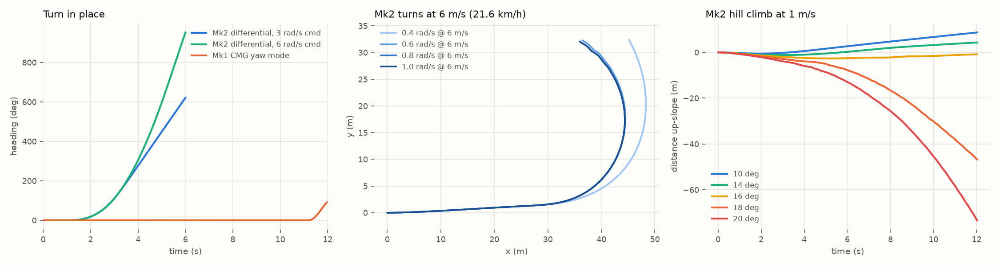

# GYRA Mk2: split tyre, differential drive, learned control

Mk2 follows from the analysis in [`04_mk2_research_and_bounds.md`](04_mk2_research_and_bounds.md).
It drops the CMG pair and splits the tyre into two independently driven halves with
outward-offset crowns. The freed mass becomes a tungsten + battery bob. Everything
below is generated: CAD → mass properties → MuJoCo model → controllers/policies.

| | |
|---|---|
| CAD | `cad/gyra2_cad.py` → `cad/out2/` (STEP, STL, mass properties, interference report) |
| Physics model | `sim/gyra2_model.py` (inertias read from the CAD), motor torque-speed model |
| Classical baseline | `sim/gyra2_sim.py` |
| Learned control | `rl/` (asymmetric PPO), see [`06_learned_control.md`](06_learned_control.md) |

## 1. What changed vs Mk1 and why

| | Mk1 | Mk2 | reason |
|---|---|---|---|
| Tyre | one drum, one ring gear | **two halves**, each with its own ring gear, joined by a wire-race slewing ring | differential drive: continuous yaw torque at any speed |
| Crown profile | single sphere | each half = sphere centred at y = ±50 mm → **two contact patches 100 mm apart** | passive roll stiffness M·g·d; no wobble mode at rest |
| Steering | lean + precession, CMG roll/yaw | **differential torque** + counter-lean bob | 20-40× faster spin, tighter high-speed turns |
| CMGs | 2 × 1.5 kg flywheels + 2 gimbal actuators | **removed** | twin crown handles roll and the differential handles yaw; 6.5 kg freed |
| Bob | 8.4 kg lead + 468 Wh, ±30° | **11 kg W-Ni-Fe + 936 Wh (13S4P)**, ±40° | more m·L (grade) and 2× energy |
| Pendulum travel | ±75° hard stop | **360° free**: nothing of the spine is in its swept volume | full m·g·L at 90°, no stop impacts |
| Compute | spine bay | on the pendulum (adds ballast) | better m·L |
| Drive ratio | 30:1 | **24:1** (15:1 gear × 1.6:1 belt) | 9.4 m/s no-load at 48 V |
| Width × height | 600 × 600 mm | 700 × 600 mm (each half keeps R 300) | |
| Mass | 41.4 kg | 45.1 kg | CoM 91 mm below centre (Mk1: 59 mm) |

**Interference check:** 0 collisions over pendulum pitch 0/±60/±120/180° × bob lean
0/±40°.

## 2. How the differential works with a pendulum drive

Both motors are mounted on the pendulum yoke. The front motor drives the left half,
the rear motor the right half.

* **Sum of torques** → reaction on the yoke → the pendulum swings → forward drive
  (gravity-limited: m·g·L = 39.7 N·m).
* **Difference of torques** → cancels inside the yoke (no pendulum swing) → a pure
  yaw couple (F_R − F_L)·d at the two contact patches. It is **not limited by the
  pendulum**, only by motor torque (82 N·m stall per half) and pivot friction.

## 3. Results from the physics model (classical controller)

| metric | Mk1 (sim) | **Mk2 (sim)** | gain |
|---|---|---|---|
| Turn in place, mean yaw rate | ~9°/s (CMG ratchet) | **163°/s** (3 rad/s cmd) · **258°/s** (6 rad/s cmd) | **18-29×** |
| Turn-in-place drift | 7 cm per 315° | **1 mm** | ~70× |
| Sensor pitch, 0 → 3 m/s → 0 | 0.75° | **0.39°** | 2× (≈ 120× vs RT-G-style pods) |
| Max grade (sim, 1 m/s) | 10° | **14°** (16° stalls) | 1.4× |
| Max stable speed | 6.4 m/s (motor) | **8.5 m/s** (9.0 m/s peak) | 1.3× |
| Turn radius at 6 m/s | ~48 m (lean only, predicted) | **17.9 m** with the classical loop | 2.7× |
| Battery | 468 Wh | **936 Wh** | 2× |

The classical yaw loop **oscillates at high speed**. Above roughly 0.5 rad/s at 6 m/s,
the yaw, roll and precession couplings make the hand-tuned loop diverge, even though
the tip-over bound allows about 4.5 m/s² of lateral acceleration. That is the gap the
learned locomotion policy targets.

## 4. Honest limits
* **Grade** stays gravity-bound: static m·L/(M·R) gives 17.4°, and 14° is
  demonstrated. No internal-drive sphere gets 10× here (see doc 04).
* **Width** grows by 100 mm. The robot is still a closed, self-righting body: lying
  on a pod, its CoM sits 92 mm off the pod sphere's centre, which rights it.
* The **forward blind wedge** of the pod LiDARs gets slightly wider (the pods move
  out by 50 mm). The centre line is seen from about 2.0 m ahead. The navigation policy
  is trained with this blind wedge modelled.
