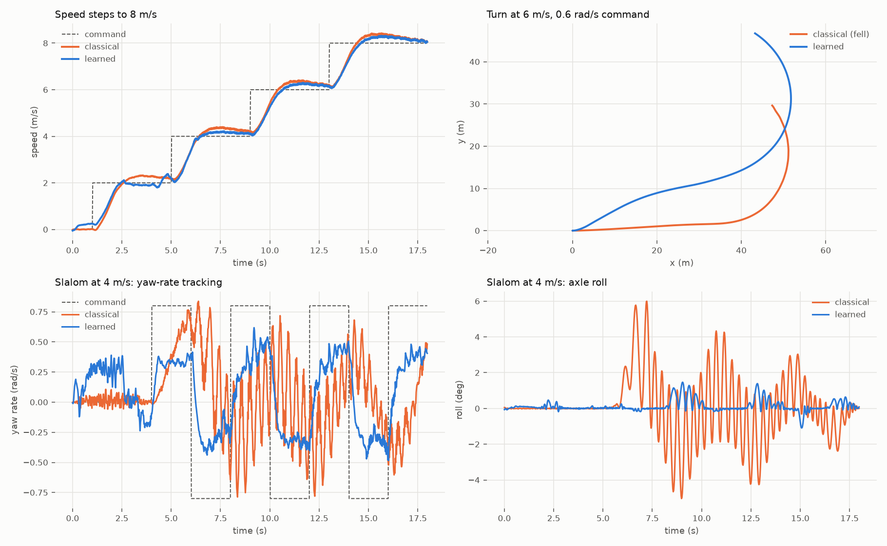

# GYRA Mk2: learned control (asymmetric PPO)

Two policies, trained in MuJoCo on the CAD-derived Mk2 model:

1. **Locomotion / teleoperation policy** (50 Hz): turns joystick commands (v, ω) into
   motor torques and a bob setpoint.
2. **Autonomous navigation policy** (10 Hz): turns pod LiDAR, stereo depth and
   odometry into (v, ω) commands for policy 1.

Both use the **asymmetric actor-critic** setup (Pinto et al., 2017). The actor only
gets signals the real robot measures, with noise and latency. The critic additionally
gets privileged simulator state. Only the actor is deployed.

Code: `rl/loco_env.py`, `rl/nav_env.py`, `rl/ppo.py`, `rl/vec_env.py`,
`rl/train_loco.py`, `rl/train_nav.py`, `rl/eval_loco.py`, `rl/eval_nav.py`.
Everything runs on CPU: 4 cores, ~2 k env-steps/s for locomotion, ~250 nav-steps/s
per core.

## 1. Locomotion policy

### Structure: residual RL over an estimator-fed classical loop
A first, fully end-to-end run plateaued: speed error ~0.6 m/s, falls ~35 % of
episodes, and exploration noise growing (log in `rl/runs/archive/loco_e2e/`). With
CPU-only compute, the faster route is **residual RL**. The classical cascade controller
(speed → pendulum angle → torque, yaw-rate → differential torque, lateral
acceleration → counter-lean) runs on *estimated* state (IMU + encoders + noise), and
the policy adds a bounded correction: ±25 N·m on the drive sum, ±25 N·m on the
differential, ±0.35 rad on the bob. The whole stack stays deployable, and learning
starts from a working controller.

### Observations
| | actor (deployable) | critic (privileged) |
|---|---|---|
| IMU | gyro (3), gravity direction (3) | true body velocity (3), yaw rate, roll, pitch |
| encoders | pendulum angle (sin, cos) + rate, both drive-motor rates, bob angle | pendulum absolute angle + rate, bob |
| controller | previous action (3), classical base action (3) | contacts L/R |
| command | v, ω | v, ω, tracking errors |
| world | — | friction (μ, torsional, rolling), mass scales (4), CoM offset (3), motor strength, gravity tilt (2), push active |
| history | 4 frames (18 each) → 74 inputs | current frame → 48 inputs |

Noise: gyro 0.02 rad/s, gravity 0.015, encoder rates 0.05 rad/s, plus 0-1 control
steps of action latency.

### Domain randomisation (per episode)
Friction 0.5-1.2 · torsional 0.008-0.025 m · rolling 0.002-0.008 m · body masses
±10 % · spine CoM ±5 mm · motor strength 0.8-1.1 · slopes up to 12° in a random
direction (curriculum) · random 50-250 N shoves (curriculum) · commands resampled
every 2-5 s (turn in place, straight, stop, mixed with |v·ω| ≤ 4 m/s²).

### Reward (per 20 ms step)
exp(−e_v²/0.5) + exp(−e_ω²/0.5) − 0.15|e_v| − 0.15|e_ω| − 0.05 ω_roll² −
0.5 max(|roll| − 0.35, 0)² − 2 θ_spine² − 0.05 Δa² − 0.02 a² − energy − pendulum
slosh; −10 on a fall (pendulum over the top, or roll > 63°).

### Curriculum
Commanded speed range 4 → 8.5 m/s, and difficulty (slope range, push rate/magnitude)
0.5 → 1.0. It advances when the smoothed tracking errors and fall rate pass the
thresholds.

## 2. Navigation policy

| | actor (deployable) | critic (privileged) |
|---|---|---|
| LiDAR | 72-beam 2-D scan × 2 frames, synthesised from both pod Mid-360s, **with the forward/rear blind wedge** (returns hidden by the tyre are dropped), 2 cm noise, 2 % dropouts | true unmasked noiseless 72-beam scan, nearest-obstacle distance |
| vision | 16 × 8 front stereo depth image (90° × 45°), noise ∝ range², < 0.35 m invalid | — |
| odometry | goal distance/bearing from encoder + gyro dead reckoning (gyro bias, wheel-radius error → drift) | true goal vector, odometry error |
| state | speed estimate, yaw rate, previous action, time | true v, ω |

Action: (v_cmd ∈ [−1, 3.5] m/s, ω_cmd ∈ ±2.5 rad/s) to the frozen locomotion policy.
Reward: 3 × progress − 0.01/step − proximity penalty − action-rate penalty, +10 on
reaching the goal (< 0.6 m), −10 on collision or fall. Worlds: a 14 × 14 m walled
arena with 8-22 random cylinders and boxes (0.25-0.9 m tall), start/goal 4-10 m apart.

Baseline: a classical **VFH-style gap follower** using the same masked scan and the
same drifting odometry, driving through the same low-level policy.

## 3. Results

### 3.1 Locomotion (deterministic tests, `rl/runs/loco/eval.json`)
Deployed policy: the residual PPO checkpoint at 3.9 M steps (`rl/runs/loco/best.pt`,
TorchScript `actor.pt` + `actor_obs_norm.json`).

| test | classical alone | **classical + learned residual** |
|---|---|---|
| **6 m/s turn, 0.6 rad/s command** | **falls** (roll 69°), RMS yaw error 1.28 rad/s | **stable**, roll 7°, RMS yaw error 0.32 rad/s, radius 18.9 m |
| 4 m/s slalom (±0.8 rad/s) | yaw error 0.85 rad/s, roll oscillation to 6° | yaw error 0.53 rad/s, roll ≤ 1.5° |
| **random commands + randomised dynamics + shoves** (12 × 21 s) | **67% falls**, abs errors 1.73 m/s / 0.83 rad/s | **8% falls**, 1.35 m/s / 0.47 rad/s |
| 300 N shove at 3 m/s, peak roll | 13.6° | 10.8° |
| turn in place, 3 rad/s command | 171°/s | 176°/s |
| speed steps 0 → 8 m/s | RMS speed error 0.77 (acceleration-limited) | 0.75 |

**Remaining flaw:** the learned residual has a small yaw-rate bias, about 0.2 rad/s at
low speed when commanded straight. RMS yaw error on the straight speed-step test is
0.16 vs 0.03 for the
classical loop. A heading-hold term or a symmetry-augmented training batch (mirror
left/right) is the next fix.

**What didn't work (kept for the record).**
1. *End-to-end PPO* (`rl/runs/archive/loco_e2e`) plateaued at ~0.6 m/s speed error
   with ~35 % falls, and its exploration noise kept growing.
2. *Training on to 8.5 M steps* with the hardest curriculum stage (7 m/s, 10.5° slopes,
   225 N shoves) **degraded** the policy: 42 % falls on the evaluation suite, against
   8 % at 3.9 M (`rl/runs/archive/loco_residual_to_8p5M/eval_8p5M.json`). The
   deployed checkpoint was chosen by evaluation, not by training reward.

### 3.2 Autonomous navigation (100 fixed random maps, `rl/runs/nav/eval.json`)
Both navigators drive through the same deployed locomotion policy and see the same
masked LiDAR and drifting odometry.

| | VFH-style baseline | **learned (asymmetric PPO)** |
|---|---|---|
| success | 72% | **79%** |
| collisions | 11% | **2%** |
| falls | 2% | 6% |
| time to goal (successes) | 9.6 s | **6.5 s** |
| mean speed (successes) | 0.86 m/s | **1.35 m/s** |

The learned navigator has **5.5× fewer collisions** and reaches goals **1.6× faster**.
It falls more often (6%): it asks the low-level for more aggressive
manoeuvres, and some of them exceed what the locomotion policy can hold. Next step:
fine-tune the two levels jointly, or add the low-level's roll margin to the navigator's
observation.

## 4. Deploying on hardware
* Run `actor.pt` (TorchScript) at 50 Hz on the Jetson. Observation = 4-frame history
  of gyro, gravity vector, pendulum/bob/drive encoders, previous action and the
  classical base action, plus the command, normalised with `actor_obs_norm.json`.
* The classical cascade runs alongside on the same estimates. The residual is added
  with the same ±25 N·m / ±25 N·m / ±0.35 rad clipping as in training.
* The levelling motor keeps its own PD loop.
* The navigator runs at 10 Hz on the Mid-360 scans (flattened to the 72-beam 2-D scan),
  the stereo depth from the two front cameras, and the wheel/gyro odometry.
